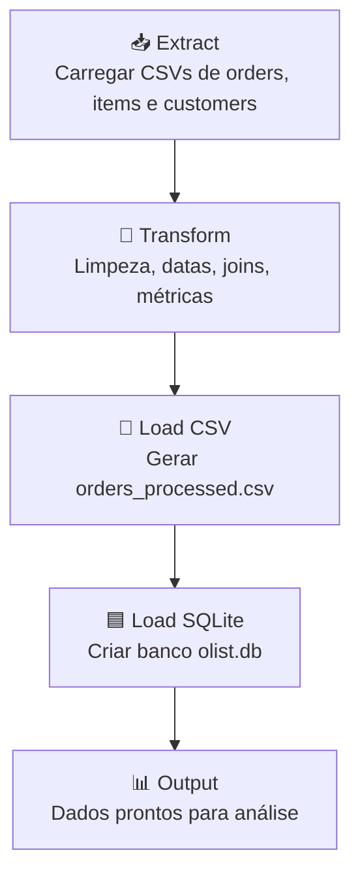

# 🚀 Pipeline de ETL com Python — Olist Brazilian E-Commerce


Projeto completo de **Engenharia de Dados**, implementando um **Pipeline ETL** utilizando o dataset  
**Brazilian E-Commerce Public Dataset by Olist (Kaggle)**.

Este pipeline abrange:

- **Extract** → Leitura dos arquivos CSV brutos  
- **Transform** → Limpeza, enriquecimento e criação de métricas  
- **Load CSV** → Geração de tabelas processadas  
- **Load SQLite** → Criação do banco `olist.db` + tabela `orders_processed`

---


## 🔄 Fluxograma do Pipeline ETL



---

## 📁 Estrutura do Diretório

```
etl_olist/
│
├── data/
│   ├── raw/
│   └── processed/
│
├── src/
│   ├── extract.py
│   ├── transform.py
│   ├── load.py
│   ├── load_sql.py
│   ├── pipeline.py
│
├── config.py
└── requirements.txt
```

---

## 🧪 Módulos do Projeto

### 📥 1. Extract — `src/extract.py`

```python
import pandas as pd
import os

def load_csv(file_name: str, base_path="data/raw/") -> pd.DataFrame:
    full_path = os.path.join(base_path, file_name)
    print(f"📥 Extraindo {file_name}...")
    return pd.read_csv(full_path)
```

---

### 🔧 2. Transform — `src/transform.py`

```python
import pandas as pd

def transform_orders(orders, items, customers):
    print("🔧 Transformando dados...")

    date_cols = [
        "order_purchase_timestamp",
        "order_approved_at",
        "order_delivered_carrier_date",
        "order_delivered_customer_date",
        "order_estimated_delivery_date"
    ]

    for col in date_cols:
        orders[col] = pd.to_datetime(orders[col], errors="coerce")

    orders["delivery_time_days"] = (
        orders["order_delivered_customer_date"] - orders["order_purchase_timestamp"]
    ).dt.days

    orders["delivery_delay_days"] = (
        orders["order_delivered_customer_date"] - orders["order_estimated_delivery_date"]
    ).dt.days

    items_grouped = items.groupby("order_id").agg(
        total_items=("order_item_id", "count"),
        total_value=("price", "sum"),
        total_freight=("freight_value", "sum")
    ).reset_index()

    orders = orders.merge(items_grouped, on="order_id", how="left")
    orders = orders.merge(customers[['customer_id','customer_city','customer_state']], 
                          on="customer_id", how="left")

    return orders
```

---

### 💾 3. Load CSV — `src/load.py`

```python
import os

def save_processed(df, filename="orders_processed.csv", base_path="data/processed/"):
    os.makedirs(base_path, exist_ok=True)
    full_path = os.path.join(base_path, filename)

    print(f"💾 Salvando dataset em: {full_path}")
    df.to_csv(full_path, index=False)
```

---

### 🟦 4. Load SQLite — `src/load_sql.py`

```python
import os
import sqlite3

def load_to_sqlite(df, db_path="data/processed/olist.db", table_name="orders_processed"):
    os.makedirs(os.path.dirname(db_path), exist_ok=True)

    print(f"🟦 Conectando ao SQLite: {db_path}")
    conn = sqlite3.connect(db_path)

    print(f"📤 Inserindo dados na tabela '{table_name}'...")
    df.to_sql(table_name, conn, if_exists="replace", index=False)

    conn.close()
    print("✅ Inserção concluída!")
```

---

### ▶️ 5. Pipeline — `src/pipeline.py`

```python
from extract import load_csv
from transform import transform_orders
from load import save_processed
from load_sql import load_to_sqlite

def run_pipeline():
    print("
🚀 Iniciando Pipeline ETL Olist...
")

    orders = load_csv("olist_orders_dataset.csv")
    items = load_csv("olist_order_items_dataset.csv")
    customers = load_csv("olist_customers_dataset.csv")

    df_final = transform_orders(orders, items, customers)

    save_processed(df_final)
    load_to_sqlite(df_final)

    print("
🎉 Pipeline ETL finalizado com sucesso!
")

if __name__ == "__main__":
    run_pipeline()
```

---

## ▶️ Execução

```bash
python src/pipeline.py
```

---

## 🧪 Validar SQLite

```python
import sqlite3

conn = sqlite3.connect("data/processed/olist.db")
cursor = conn.cursor()

cursor.execute("SELECT * FROM orders_processed LIMIT 10")
print(cursor.fetchall())

conn.close()
```

---

## 📊 Próximas Evoluções

- Criar modelo estrela (Dimensões e Fato)
- Implementar DAG no Airflow
- Desenvolver Data Quality Checks
- Criar dashboard Power BI/Looker
- Implementar carga incremental

---

## ✨ Autor

**Daniel Eduardo do Carmo**  
Engenharia de Dados • Python • ETL • SQLite • Kaggle

---

## 🔗 Links

- Dataset: https://www.kaggle.com/datasets/olistbr/brazilian-ecommerce  
- DB Browser: https://sqlitebrowser.org  
